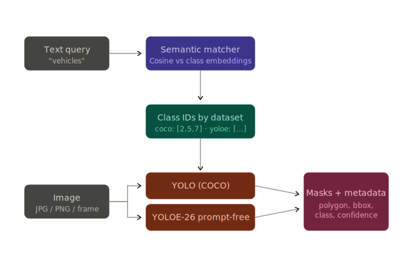
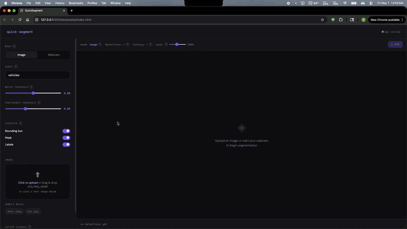

# Quick-Segment

Quick-Segment is a natural language image segmentation API.
It takes a text query like "vehicles on the street", maps that intent to likely object classes, and returns instance masks, boxes, and confidence scores from YOLO segmentation models.

This project is designed to showcase practical ML systems engineering: semantic retrieval, multi-dataset routing, inference orchestration, and clean API design.

## Why This Project

Most segmentation APIs require exact class names ("car", "truck", "person").
Quick-Segment allows flexible natural language queries and automatically finds the most relevant classes before running segmentation.
This approach still leverages strong pretrained segmentation models after class selection, which can be more accurate than traditional open-vocabulary segmentation pipelines.

Core value:
- Natural language to class mapping with sentence embeddings
- Dataset-aware inference routing
- Structured JSON output ready for visualization or downstream apps

## Preview

**Architecture diagram**
 


**GUI Demo**
 


## How It Works

 
```text
query + image -> semantic matching -> matched classes -> dataset grouping -> YOLO segmentation -> unified detections
```

1. A client uploads an image and query text.
2. The query is embedded with `all-mpnet-base-v2` and compared with known class labels using cosine similarity.
3. Matching classes above a threshold are grouped by dataset.
4. Each dataset is processed by its corresponding YOLO segmentation model.
5. Results are merged into one response containing:
   - `class_name`
   - `dataset`
   - `confidence`
   - `bbox`
   - `mask` (polygon coordinates)

## Tech Stack

- **Backend:** FastAPI
- **Semantic Matching:** sentence-transformers (`all-mpnet-base-v2`) + cosine similarity
- **Segmentation Models:** Ultralytics YOLO / YOLOE
- **Image Processing:** PIL

## Project Structure

```text
quick-segment/
  api.py                 # FastAPI app and endpoints
  matcher.py             # query -> semantic class matching
  inference.py           # dataset-aware YOLO segmentation wrapper
  datasets/
    coco.py              # COCO class -> id mapping
    yoloe.py             # YOLOE class -> id mapping
  tests/
    test_matcher.py
    test_inference.py
```

## API Endpoints

### `POST /segment`

Run segmentation using an uploaded image and natural language query.

- **Content type:** `multipart/form-data`
- **Required:**
  - `file`: image file (`image/*`)
  - `query`: natural language query (query parameter)
- **Optional query parameters:**
  - `conf` (default `0.4`): model confidence threshold
  - `threshold` (default `0.5`): semantic match threshold

Example:

```bash
curl -X POST "http://127.0.0.1:8000/segment?query=vehicles&conf=0.4&threshold=0.5" \
  -F "file=@tests/media/street.jpg"
```

Response shape:

```json
{
  "query": "vehicles",
  "matches": [
    { "class_name": "car", "dataset": "coco" }
  ],
  "detections": [
    {
      "class_name": "car",
      "dataset": "coco",
      "confidence": 0.913,
      "bbox": [35.14, 120.66, 413.89, 350.77],
      "mask": [[x, y], [x, y]]
    }
  ]
}
```

### `GET /classes`

Returns registered class lists by dataset.

### `GET /health`

Basic health check endpoint.

### `GET /media-list`

Lists sample images available in `tests/media`.

## Supported Datasets and Models

| Dataset | Model | Notes |
| ------- | ----- | ----- |
| COCO | `yolo26n-seg.pt` | General 80-class object segmentation |
| YOLOE | `yoloe-26s-seg-pf.pt` | Extended class vocabulary |

## Local Development

### Requirements

- Python 3.11+
- `pip`

### Setup

```bash
git clone https://github.com/krish1patel/quick-segment.git
cd quick-segment
python -m venv .venv
source .venv/bin/activate
pip install -r requirements.txt
```

### Run the API

```bash
uvicorn api:app --reload
```

Then open:
- `http://127.0.0.1:8000/docs` for interactive Swagger docs
- `http://127.0.0.1:8000/health` for quick status checks

Note: model weights are downloaded automatically on first inference run.


## Future Improvements

- Add ranking/limit controls for top semantic matches
- Add benchmark scripts for latency and throughput
- Add optional mask simplification for smaller payloads
- Add lightweight frontend demo for interactive query testing
- Add more pretrained models
- Add user selected pretrained models


## License & dependencies

QuickSegment is licensed under the [MIT License](LICENSE).

This project depends on third-party libraries with their own licenses. Most
notably, [Ultralytics](https://github.com/ultralytics/ultralytics) (used for
the YOLO and YOLOE models) is distributed under **AGPL-3.0**. If you intend
to use this project — or models trained with Ultralytics — in a commercial
or distributed setting, please review Ultralytics' licensing terms and
obtain a commercial license if applicable.
